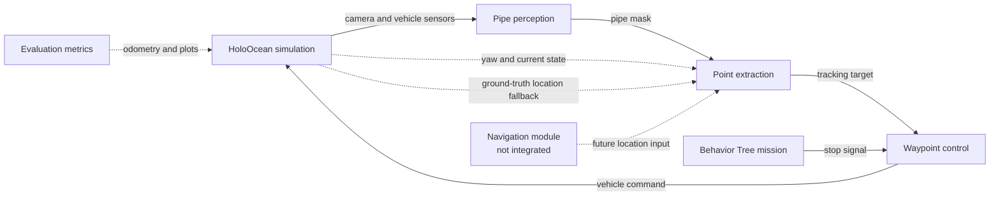
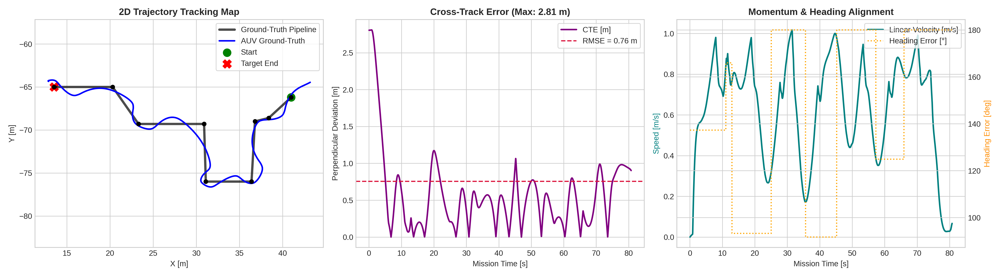
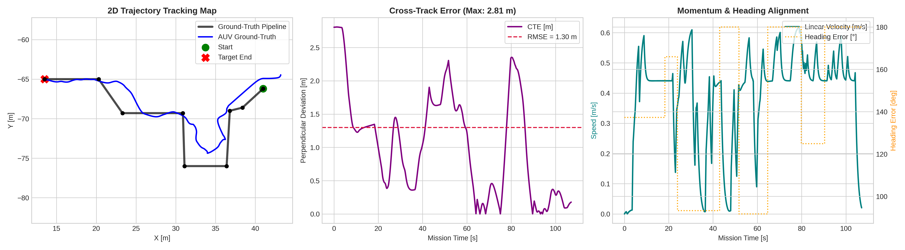

# Pipe Track ROS 2

ROS 2 integration for pipe tracking with the HoloOcean underwater simulator. The workspace connects simulated camera and vehicle sensors to perception, pipe-point extraction, and vehicle control nodes.

## Status

- `pipe_track.launch.py` runs the coordinate-free scan. It uses the camera mask, yaw, and the vehicle's current state to select the next target, without building a world-coordinate map.
- `pipe_track_navi.launch.py` runs the coordinate/map-based scan. It is designed to receive vehicle location from a navigation module, but that module is not integrated yet, so it currently reads the required location from HoloOcean ground truth.
- Continuous trajectory optimization is integrated into the coordinate-free planner.
- Behavior Tree mission termination is integrated into both bringup modes.
- The HoloOcean map used by this project will be shared separately when it is ready.
- `pipe_track_evaluation` now provides the starting point for academic odometry metrics and trajectory plots. RMSE calculation and timestamp alignment are still being completed.

## Repository layout

| Package | Purpose |
| --- | --- |
| `pipe_track_sim` | Runs the HoloOcean simulation and publishes ROS 2 sensor topics. |
| `pipe_track_perception` | Segments the pipe from the downward camera image. |
| `pipe_track_planning` | Extracts pipe points and produces tracking targets. |
| `pipe_track_control` | Controls the vehicle toward the generated targets. |
| `pipe_track_bringup` | Launch files and shared parameters. |
| `pipe_track_evaluation` | Collects ground-truth and estimated odometry for academic metrics and plots. |
| `pipe_track_mission` | Runs Behavior Tree mission logic and publishes the stop signal. |

There are currently two bringup modes, corresponding to the two scan algorithms described in [`media/pipeTrack.md`](media/pipeTrack.md):

1. **Scan without coordinates**: `pipe_track.launch.py`. This is the currently usable end-to-end mode. It uses the downward camera, segmentation mask, yaw, and current vehicle state. It does not require the separate navigation module.
2. **Main coordinate-based scan**: `pipe_track_navi.launch.py`. This projects detected pixels into world positions, classifies explored/object/interested areas, and selects the closest interested point while building a map. The navigation module that should provide the vehicle location has not been integrated yet; for now, this path uses HoloOcean ground truth for location.

Both launch files also start `pipe_track_mission/behaviour_node`. The selected tree is controlled by the mode-specific parameter file:

| Launch file | Mission tree | Termination condition |
| --- | --- | --- |
| `pipe_track.launch.py` | `reactive_mission.xml` | Sustained visual turn-back signal, indicating that the pipe has been lost or the vehicle is continuously turning back. |
| `pipe_track_navi.launch.py` | `map_mission.xml` | Exploration map has no remaining points. |

When a termination condition succeeds, the Behavior Tree publishes `/movement/finished_execution`, which stops waypoint control.

## Implemented features

### Continuous trajectory optimization

The coordinate-free planner now produces a smoother tracking target from multiple pipe look-ahead points:

- Dynamic Bezier look-ahead changes with the estimated pipe angle. Straighter sections use a farther look-ahead; sharper curves use a nearer one.
- Spatial smoothing uses a cubic Bezier trajectory through the current AUV center and the selected pipe points.
- Temporal smoothing uses an exponential moving average to reduce frame-to-frame target jitter.
- The temporal filter resets when the pipe is lost so stale targets are not carried into a new search.

The optimized target is published through `/trajectory/waypoint` for the control node.

### Academic evaluation metrics

`pipe_track_evaluation` subscribes to:

- `holocean/odom` for simulator ground truth
- `auv/estimated_odom` for the estimated vehicle trajectory

The package is structured to compare trajectories and generate plots for cross-track error, heading error, velocity, and cumulative trajectory error. The current `calculate_rmse()` method is still a work in progress, so the figures in `media/results` should be treated as benchmark outputs rather than a reproducible evaluation command.

### Behavior Tree mission termination

The mission package uses BehaviorTree.CPP and Groot 2 publishing. Its custom nodes monitor planning signals and issue one shared stop command:

- `IsConstantlyTurningBack` confirms a persistent visual turn-back condition before stopping the reactive mission.
- `IsExplorationEmpty` stops the map-based mission when no unexplored points remain.
- `StopAUV` publishes `/movement/finished_execution` to the waypoint controller.

## Requirements

- Ubuntu with a supported ROS 2 distribution
- Python 3
- `colcon`
- A working ROS 2 installation with the packages declared in the package manifests
- NVIDIA GPU and a CUDA-compatible PyTorch installation are recommended for real-time segmentation
- The HoloOcean map for this project, to be provided separately

ROS 2 packages such as `rclpy`, `sensor_msgs`, `cv_bridge`, `nav_msgs`, and `launch_ros` should be installed through the ROS 2 distribution. Python dependencies are listed in [`requirements.txt`](requirements.txt).

## Installation

There are two supported ways to run the project: the pre-configured Docker environment (recommended) or a native local installation.

### Method 1: Docker (Recommended)

The Docker setup provides ROS 2 Jazzy, the ROS dependencies, CUDA-enabled PyTorch, BehaviorTree.CPP, and the Unreal Engine rendering libraries used by HoloOcean.

#### Prerequisites

- NVIDIA drivers version 535 or newer
- [NVIDIA Container Toolkit](https://docs.nvidia.com/datacenter/cloud-native/container-toolkit/latest/install-guide.html)
- Docker Engine and Docker Compose V2
- The HoloOcean `BauRov` world package installed on the host at `~/.local/share/holoocean/2.3.0/worlds`
- The UNet35 segmentation model downloaded from [Google Drive](https://drive.google.com/drive/folders/1qJhubrfIRAHTARl1LSkv2sRGxkRqvEHG?usp=sharing) and saved as `src/pipe_track_perception/pipe_track_perception/models/segment/best_pipe_unet35.pth`

#### Simulation World Assets

The `BauRov` HoloOcean environment package is approximately 1.6 GB and is required to run the simulation. Download [`BauRov-v2.3.0.zip`](https://github.com/metinegearal/auv_pipe_tracking/releases/download/v1.0.0/BauRov.zip) from the project release, then unpack it into the default HoloOcean world directory on the host:

```bash
mkdir -p ~/.local/share/holoocean/2.3.0/worlds
wget -O /tmp/BauRov.zip \
	https://github.com/metinegearal/auv_pipe_tracking/releases/download/v1.0.0/BauRov.zip
unzip /tmp/BauRov.zip -d ~/.local/share/holoocean/2.3.0/worlds/
rm /tmp/BauRov.zip
```

Replace `<your-username>/<your-repo>` with the GitHub repository that hosts the release asset. Verify that the extracted `BauRov` directory is under `~/.local/share/holoocean/2.3.0/worlds/`. The Docker Compose file mounts `~/.local/share/holoocean` from the host into the container automatically.

#### Build and start

From the repository root, allow the container to access the host X11 display for Unreal Engine rendering:

```bash
xhost +local:root
docker compose up -d --build
```

The default image installs the nightly PyTorch CUDA 13.0 wheels. To use a different PyTorch CUDA wheel channel, set `TORCH_INDEX_URL` when building the image. For example, for the stable CUDA 12.4 wheels:

```bash
TORCH_INDEX_URL=https://download.pytorch.org/whl/cu124 docker compose up -d --build
```

Choose a PyTorch wheel channel compatible with the host NVIDIA driver and GPU. Docker cannot reliably select this automatically during `docker build`: the host GPU is exposed at container runtime, while Python dependencies are installed while the image is being built. The explicit build argument keeps the image reproducible and allows the CUDA channel to be changed without editing the Dockerfile.

Open a shell in the running container and build the ROS 2 workspace:

```bash
docker exec -it auv_workspace bash
cd /workspace
colcon build --symlink-install
source install/setup.bash
```

The repository is mounted at `/workspace/src/pipe_track_ros2`, so source changes on the host are immediately visible inside the container.

### Method 2: Local Installation

For a native installation, use a supported Ubuntu and ROS 2 distribution with a CUDA-compatible PyTorch setup. Follow the [HoloOcean installation guide](https://byu-holoocean.github.io/holoocean-docs/v2.3.0/usage/installation.html) for the simulator and map prerequisites.

From the repository root:

```bash
python3 -m venv .venv
source .venv/bin/activate
python -m pip install --upgrade pip
python -m pip install -r requirements.txt
```

Download the [UNet35 segmentation model](https://drive.google.com/drive/folders/1qJhubrfIRAHTARl1LSkv2sRGxkRqvEHG?usp=sharing) and save it to:

```text
src/pipe_track_perception/pipe_track_perception/models/segment/best_pipe_unet35.pth
```

The requirements file installs HoloOcean from Git. Install the HoloOcean `BauRov` world/map separately according to the HoloOcean documentation.

Source ROS 2 and build the workspace:

```bash
source /opt/ros/<ros-distro>/setup.bash
rosdep install --from-paths src --ignore-src -r -y
colcon build --symlink-install
source install/setup.bash
```

## Running

Whether running natively or inside `auv_workspace`, the launch commands are the same. Start the currently supported coordinate-free scan with reactive mission termination:

```bash
source /opt/ros/<ros-distro>/setup.bash
source install/setup.bash
ros2 launch pipe_track_bringup pipe_track.launch.py
```

The launch file starts the simulator, perception, coordinate-free point extraction, and waypoint control nodes. Parameters are loaded from `src/pipe_track_bringup/config/params.yaml`. This path uses yaw and the current vehicle state rather than a navigation-provided world position.

Run the coordinate-based scan with the current ground-truth location fallback and map completion termination:

```bash
ros2 launch pipe_track_bringup pipe_track_navi.launch.py
```

Its parameters are loaded from `src/pipe_track_bringup/config/params_navi.yaml`. Once the navigation module is integrated, its location output should replace the direct HoloOcean ground-truth input.

## Main data flow



The simulator bridge publishes topics under the `holocean/` namespace, including camera images, IMU, magnetometer, DVL, and odometry data. The perception node publishes the pipe mask on `object/mask`; downstream topic names and message contracts may evolve with the navigation and evaluation integrations.

## Results

The repository includes benchmark figures under [`media/results`](media/results). They compare the ground-truth pipeline with the AUV trajectory and report cross-track, heading, velocity, and cumulative trajectory error.

| Benchmark | Reported trajectory RMSE |
| --- | ---: |
| Base benchmark | 0.78 m |
| Base movement benchmark | 0.71 m |
| Base trajectory optimization benchmark | 0.76 m |
| Navigation benchmark | 1.30 m |
| Navigation movement benchmark | 1.10 m |





The plotted values are included as reference results from the current experiments; they are not a substitute for a finalized, reproducible evaluator.

## Development

After changing a package, rebuild only the affected package when possible:

```bash
colcon build --symlink-install --packages-select <package-name>
source install/setup.bash
```

## Contact

**Metin Ege Aral**  
Software Lead, Autonomous Underwater Vehicles 
* **Email:** [metinegearal@gmail.com](mailto:metinegearal@gmail.com)
* **LinkedIn:** [linkedin.com/in/metin-ege-aral-55a492226](https://www.linkedin.com/in/metin-ege-aral-55a492226)

*I am currently seeking remote internships and graduate research opportunities in autonomous systems, edge ML, and spatial perception. If you have any questions about this architecture or potential collaborations, feel free to reach out.*
