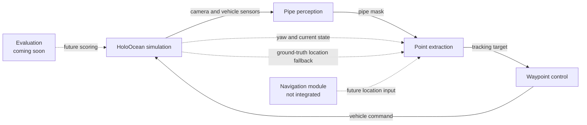

# Pipe Track ROS 2

ROS 2 integration for pipe tracking with the HoloOcean underwater simulator. The workspace connects simulated camera and vehicle sensors to perception, pipe-point extraction, and vehicle control nodes.

## Status

- `pipe_track.launch.py` runs the coordinate-free scan. It uses the camera mask, yaw, and the vehicle's current state to select the next target, without building a world-coordinate map.
- `pipe_track_navi.launch.py` runs the coordinate/map-based scan. It is designed to receive vehicle location from a navigation module, but that module is not integrated yet, so it currently reads the required location from HoloOcean ground truth.
- The HoloOcean map used by this project will be shared separately when it is ready.
- `pipe_track_evaluation` is a placeholder. It will receive the scoring parameters and evaluation implementation in a future update.

## Repository layout

| Package | Purpose |
| --- | --- |
| `pipe_track_sim` | Runs the HoloOcean simulation and publishes ROS 2 sensor topics. |
| `pipe_track_perception` | Segments the pipe from the downward camera image. |
| `pipe_track_planning` | Extracts pipe points and produces tracking targets. |
| `pipe_track_control` | Controls the vehicle toward the generated targets. |
| `pipe_track_bringup` | Launch files and shared parameters. |
| `pipe_track_evaluation` | Reserved for the upcoming scoring and evaluation system. |

There are currently two bringup modes, corresponding to the two scan algorithms described in [`media/pipeTrack.md`](media/pipeTrack.md):

1. **Scan without coordinates**: `pipe_track.launch.py`. This is the currently usable end-to-end mode. It uses the downward camera, segmentation mask, yaw, and current vehicle state. It does not require the separate navigation module.
2. **Main coordinate-based scan**: `pipe_track_navi.launch.py`. This projects detected pixels into world positions, classifies explored/object/interested areas, and selects the closest interested point while building a map. The navigation module that should provide the vehicle location has not been integrated yet; for now, this path uses HoloOcean ground truth for location.

## Requirements

- Ubuntu with a supported ROS 2 distribution
- Python 3
- `colcon`
- A working ROS 2 installation with the packages declared in the package manifests
- NVIDIA GPU and a CUDA-compatible PyTorch installation are recommended for real-time segmentation
- The HoloOcean map for this project, to be provided separately

ROS 2 packages such as `rclpy`, `sensor_msgs`, `cv_bridge`, `nav_msgs`, and `launch_ros` should be installed through the ROS 2 distribution. Python dependencies are listed in [`requirements.txt`](requirements.txt).

## Installation

From the repository root:

For holoocean installation:
https://byu-holoocean.github.io/holoocean-docs/v2.3.0/usage/installation.html

```bash
python3 -m venv .venv
source .venv/bin/activate
python -m pip install --upgrade pip
python -m pip install -r requirements.txt
```

The requirements file installs HoloOcean directly from its Git repository. The HoloOcean map is not included in this repository; install or copy the shared map according to the map package's instructions when it becomes available.

Source the ROS 2 environment, then build the workspace:

```bash
source /opt/ros/<ros-distro>/setup.bash
cd pipe_track_ros2
rosdep install --from-paths src --ignore-src -r -y
colcon build --symlink-install
source install/setup.bash
```

## Running

Start the currently supported coordinate-free scan:

```bash
source /opt/ros/<ros-distro>/setup.bash
source install/setup.bash
ros2 launch pipe_track_bringup pipe_track.launch.py
```

The launch file starts the simulator, perception, coordinate-free point extraction, and waypoint control nodes. Parameters are loaded from `src/pipe_track_bringup/config/params.yaml`. This path uses yaw and the current vehicle state rather than a navigation-provided world position.

Run the coordinate-based scan with the current ground-truth location fallback:

```bash
ros2 launch pipe_track_bringup pipe_track_navi.launch.py
```

Its parameters are loaded from `src/pipe_track_bringup/config/params_navi.yaml`. Once the navigation module is integrated, its location output should replace the direct HoloOcean ground-truth input.

## Main data flow



The simulator bridge publishes topics under the `holocean/` namespace, including camera images, IMU, magnetometer, DVL, and odometry data. The perception node publishes the pipe mask on `object/mask`; downstream topic names and message contracts may evolve with the navigation and evaluation integrations.

## Evaluation

The `pipe_track_evaluation` package currently contains only a placeholder entry point. Scoring parameters and the evaluation nodes/scripts will be added in a later update. Until then, system performance should be assessed using recorded runs and the simulator outputs directly.

## Development

After changing a package, rebuild only the affected package when possible:

```bash
colcon build --symlink-install --packages-select <package-name>
source install/setup.bash
```
